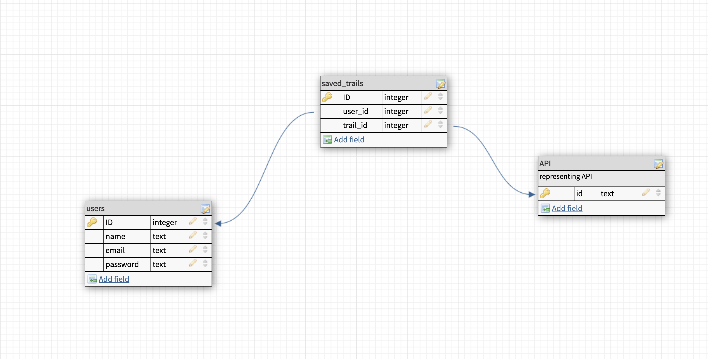
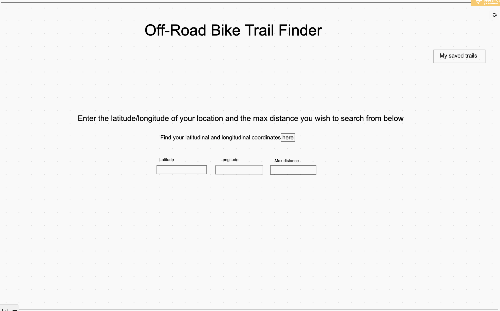
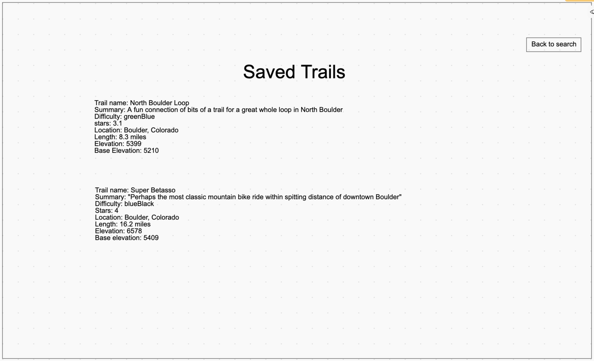

# Project 2 Planning

Fork & Clone this repo.

## Part 1

Review the [Project 2 requirements](https://romebell.gitbook.io/sei-1019/projects/project-2) and check out some [examples](https://tmdarneille.gitbook.io/seirfx/11-projects/past-projects/project2).

In this space below, list **THREE** ideas for your Project 2. For each idea, include [user stories](https://revelry.co/user-stories-that-dont-suck/) for each idea and a link to the API(s) you want to use for it.

--------------------------------------------------------
1. AI audio mastering app
- I feel like I might be biting off more than I can chew for this idea. Maybe a better project 3 or 4 idea?
As a user, I want to be able to upload my track for mastering
As a user, I want to be able to set my target loudness for the final master
As a user, I want to be able to downlaod my newly mastered track
As a user, I want to be able to see a list of all the tracks I've uploaded for mastering
API: https://aimastering.com/api_docs/

2. News search app
As a user, I want to be able to search for articles and save individual articles to my reference page
As a user, I want to be be able to make comments on articles I've saved
API: https://developer.nytimes.com/docs/articlesearch-product/1/overview

3. Off-road bike trail app
As a user, I want to be able to search for trails near me and save trails I've ridden, and trails I want to ride
As a user, I want to be able to make comments on saved trails about level of difficulty, etc
API: https://www.mtbproject.com/data

---------------------------------------------------------

Make a PR when you're done!

---

## Part 2

In the space below:
* either embed or link a completed ERD for your approved P2 idea
* if there are any changes/additions to your user stories, place your full set of revised user stories here
* either embed or link wireframes for every page of your app

----------------------------------------------------------
### ERD

----------------------------------------------------------
### User Stories
Ability to log in with my email
Ability to search bike trails up to 500 miles from my location
Abliity to save trails to a personal list
Ability to keep my list saved to my account when logged out

----------------------------------------------------------
### Wireframes
Homepage

My List page

----------------------------------------------------------

Make a PR when you're done!
